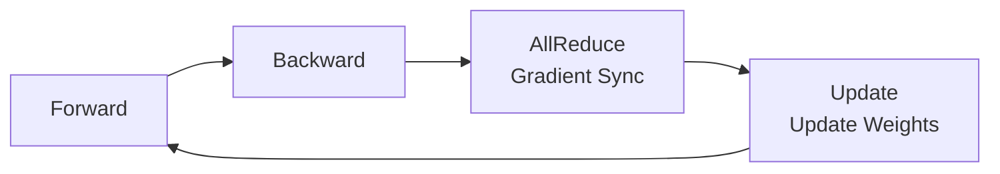
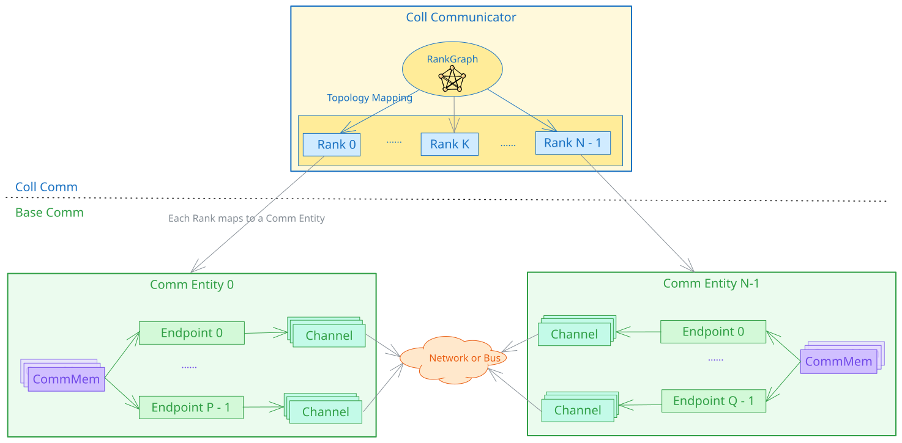
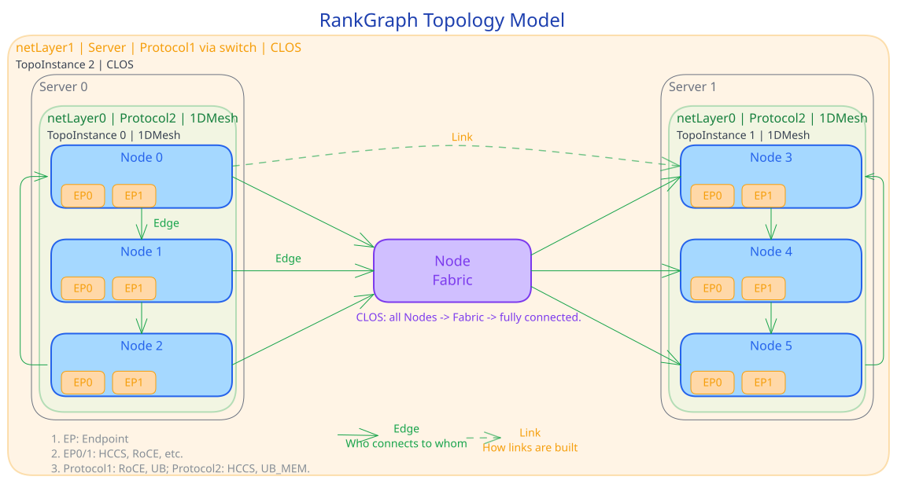
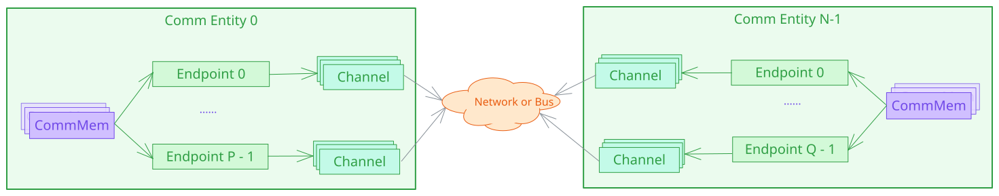
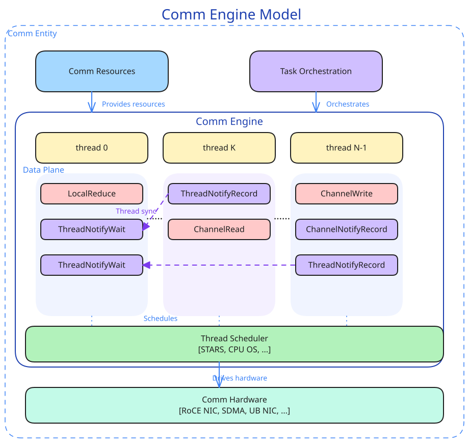
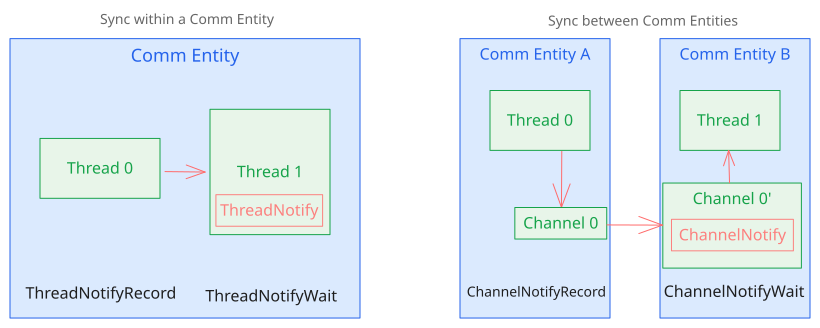
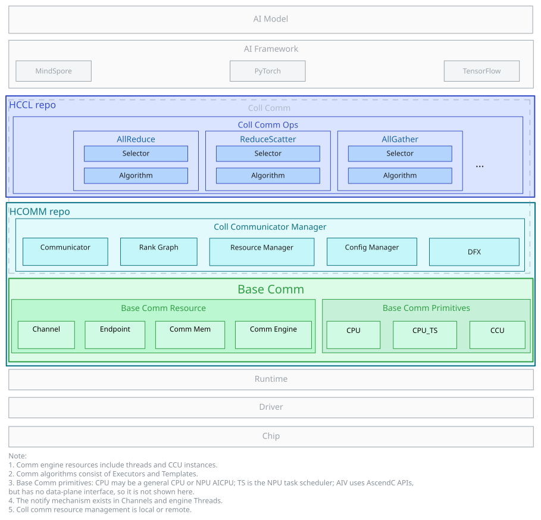
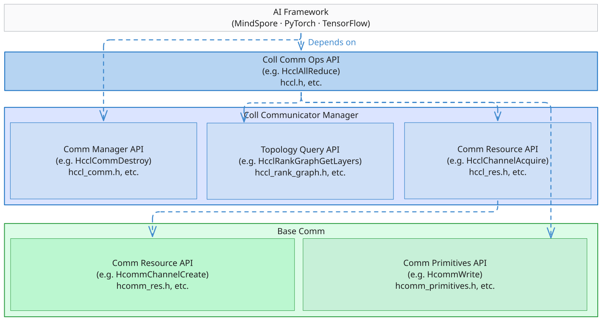

# HCCL & HCOMM Software Architecture Overview

---

## 1 HCCL Collective Communication Overview

### 1.1 Why Collective Communication Is Needed

Large model training and inference = multi-card collaboration, and **communication is the scaling bottleneck**



- **Training**: In data parallelism, each NPU processes different samples. After each iteration, AllReduce is required to synchronize gradients. Model parallelism and expert parallelism also rely on AllGather, ReduceScatter, and AlltoAll for collaboration.
- **Inference**: Large model inference also requires tensor parallelism and expert parallelism collaboration. Communication latency directly affects the time to first token and throughput.
- **Collective communication**: Enables all nodes to exchange data in parallel, efficiently, and in an orderly manner, significantly reducing synchronization overhead.
- HCCL = **A high-performance collective communication library for Ascend NPU clusters**, enabling multiple NPUs to work together efficiently.

### 1.2 HCCL Core Capabilities

| Dimension | Capability |
|------|------|
| **Collective communication primitives** | AllReduce, Broadcast, AllGather, ReduceScatter, AlltoAllv, Send, Receive, and so on |
| **Communication algorithms** | Ring, Mesh, RHD (Halving-Doubling), Star + proprietary algorithms |
| **Main communication protocols** | UB_CTP, UB_RTP, UBoE, RoCE (v2), HCCS, UB_MEM |
| **Execution modes** | Single-operator mode + graph mode |
| **Extensibility** | Custom communication operator development |
| **Application scenarios** | Collective communication for large model training (data/model/expert parallelism) and inference (TP/PP/EP) |

HCCL is positioned in the CANN software stack — between AI frameworks and hardware drivers, bridging the upper and lower layers:


---

## 2 Collective Communication Model

### 2.1 Concepts and Relationships

Collective communication involves three core concepts:

| Term | Brief Description | Corresponding Hardware |
|------|-----------|---------|
| **Communicator** | The context for collective communication execution, managing the entities and resources that participate in communication | Multiple NPUs |
| **Rank** | A member of the communicator, with a unique Rank ID (starting from 0) | One NPU |
| **RankGraph** | The communication relationship graph between Ranks, describing "who connects to whom and how" | Network topology |



---

### 2.2 RankGraph Topology Model Overview

RankGraph uses a graph to model the connection relationships between different Ranks within a communicator, and introduces topology layer abstractions to adapt to the hierarchical structure of large-scale clusters. Note that Edge/Link in RankGraph correspond to different names than Link/Path in NCCL, as shown in the following table.

| Concept | Brief Description | Analogy |
|------|-----------|------------|
| **Node** | A node in the graph, divided into communication entities and Fabric (switch/routing abstraction) | Communication entity = an NPU with network ports; Fabric = a switch cluster |
| **Endpoint** | The communication device of a Node (logical concept). A Node can have multiple Endpoints. One Endpoint maps to one physical port (which can be a Bonding port, hardware-controlled, transparent to software). One physical port can be shared by multiple Endpoints. | Network ports on an NPU. One NPU can have multiple network ports. Bonding ports are transparent to software. |
| **Edge** | The connection relationship between Nodes, with Endpoints at both ends (corresponds to Link in NCCL) | A network cable, plugged into network ports on different NPUs at both ends |
| **Link** | The linkable information extracted from an Edge between two communication entities (including both Endpoints + protocol), corresponding to Path in NCCL | A description of the linkable path between two NPUs |
| **netLayer** | The topology layer. Communication quality decreases as the layer level increases. Intra-server is Layer0 (for example, HCCS direct connection), inter-server is Layer1 (for example, RoCE through a switch) | Intra-server 8-card HCCS direct connection is the fastest (Layer0); inter-server through a switch is slower (Layer1) |
| **Fabric** | An abstraction of network switch/routing groups. Communication entities connected to it can communicate with each other. Two connected Fabrics do not exist in the same network layer. | A switch that enables all NPUs plugged into it to communicate with each other |
| **TopoInstance** | A topology instance within each layer | Eight NPU cards in the same rack form a 1DMesh instance |

> **Layer key points**: Clusters are naturally layered (Layer). Each layer contains topology instances (TopoInstance), and communication quality decreases as the layer level increases. Topology types include Fullmesh, 1DMesh, CLOS, Ring, and so on.
> **Progressive relationship**: Edge describes "who connects to whom" → Link describes "how to establish the link" → Channel describes "how to communicate". A Channel is instantiated based on a Link and is the actual usable data channel. For details, see 2.3.



---

### 2.3 Base Communication Overview

The foundation of collective communication consists of four **primitive concepts** — the basic elements that constitute all communication operations:

| Concept | Brief Description | Corresponding Hardware |
|------|-----------|---------|
| **Communication device (Endpoint)** | The logical interface for network communication, including protocol and address | NPU network port / Host NIC |
| **Communication channel (Channel)** | The data channel between communication devices at both ends (including sync Notify) | RoCE QP / UB Jetty connection |
| **Communication memory (CommMem)** | Memory segments registered to the communicator and accessible by communication devices (Endpoints) | NPU On-chip memory / Host memory |
| **Communication engine (CommEngine)** | The module that executes communication tasks, including Threads and thread schedulers, driving communication hardware to transfer data | AICPU_TS, CCU, AIV |

> **Composition relationship**: Channel = communication devices at both ends + communication protocol + N Notifys



---

#### 2.3.1 Memory Semantic Primitives vs. Network Semantic Primitives

| | Network Semantic Primitives | Memory Semantic Primitives |
|--|---------|---------|
| **Core object** | Channel (communication channel) | Communication device + mapped memory |
| **Operation mode** | Write / Read / Notify | Local copy (like operating on local memory) |
| **Communication model** | Unilateral operation, bilateral operation (requires cooperation from both ends) | Unilateral operation (only requires one end to initiate) |
| **Applicable protocols** | RoCE, UB | UB_MEM, HCCS |

 

> Which semantic to choose depends on the underlying protocol and scenario requirements

---

### 2.4 Communication Engine Overview

The communication engine is the **core module that executes communication tasks** within a communication entity. As shown in the following figure, it receives **communication resources** (Endpoint/Channel/CommMem, see 2.3) and tasks dispatched by **communication task orchestration** from above, and drives **communication hardware** to complete data transfer through a **thread execution scheduler** from below.



- **Thread**: The execution context for communication tasks, carrying a sequence of data plane operators (LocalReduce, ChannelRead/Write, Notify, and so on). An engine can contain multiple Threads executing concurrently.
- **Thread execution scheduler**: Schedules operators on Threads to hardware for execution, such as TS (Task Scheduler) / STARS / operating system
- **Communication hardware**: The hardware that actually transfers data, such as RoCE NIC, SDMA, and UB NIC
- **Inter-thread synchronization**: Different Threads coordinate execution order through ThreadNotify/ChannelNotify (for details, see 2.5)

> **In short**: Communication engine = Thread (execution context) + thread scheduler (scheduling execution). The AICPU_TS engine completes tasks through **AICPU running communication Kernels and TS scheduling Tasks** in coordination.

Depending on the Thread abstraction and scheduling method, common communication engines include AICPU_TS, CPU_TS, AIV, and CCU:

| Communication Engine | Thread Abstraction | Description | Characteristics | Applicable Scenarios |
|------|------------|------|-------|---------|
| **AICPU_TS** | NPU Stream | AICPU runs communication Kernels and submits communication Task descriptors. TS schedules them to hardware for execution. | Does not occupy compute cores. Task descriptor submission. | Large data volume communication |
| **CPU_TS** | NPU Stream | Host CPU runs communication logic. TS schedules and submits. | Does not occupy compute cores. High submission overhead. | Atlas A2 specific |
| **AIV** | AICore Block | Vector Core directly executes communication operators. | Low latency. Occupies Vector cores. | Small data, low latency |
| **CCU** | Mission | Hardened communication unit. Microcode execution. | Hardened scheduling. Microcode execution. | Dedicated hardware communication |

> The same communicator uses only one engine by default. Operator developers select the engine automatically through the algorithm selector.

---

#### 2.4.1 AICPU_TS Communication Engine

- Task descriptor submission mode


1. The Host submits an AICPU Kernel to the task queue
2. The TS scheduler dispatches the AICPU Kernel to the AICPU for execution
3. The AICPU submits communication Task descriptors to the TS queue
4. The TS scheduler dispatches communication Tasks to executors

> **Key point**: AICPU submits communication tasks through Task descriptors and **does not occupy compute cores**. It is suitable for large data and high bandwidth scenarios.

#### 2.4.2 CCU Communication Engine

- Dedicated acceleration unit execution mode

CCU (Collective Communication Unit) is a dedicated collective communication coprocessor located on the IO Die. The Thread abstraction is Mission.


1. The Host submits a CCU instruction sequence (consisting of CCU-recognizable instructions) to the CCU instruction space, and simultaneously submits a CCU Kernel task to the task queue
2. The CCU Kernel is scheduled by the scheduler and sent to the CCU for execution
3. The CCU executes the corresponding instruction stream and uses URMA (Unified Remote Memory Access) to complete data transfer

> **Key point**: CCU is a dedicated collective communication acceleration unit that executes pre-installed CCU instruction streams (transferring data through URMA). It offers **high bandwidth and low latency** with minimal occupation of compute cores and memory bandwidth. However, it is limited by on-chip resources and supports a limited number of communicators (Ascend 950PR&950DT products).

#### 2.4.3 AIV Communication Engine

- Vector Core execution mode


1. The Host submits an AIV Kernel to the task queue
2. The TS scheduler dispatches the AIV Kernel to the Vector Core
3. The Vector Core uses different protocols to complete data transfer

> **Key point**: AIV offers low latency but **occupies Vector compute cores**. It is suitable for small data and low latency scenarios.

---

### 2.5 Synchronization Mechanism Overview

There are two scenarios for synchronization in communication:

| Synchronization Method | Scenario | Description | Interface Prototype |
|---------|------|------|-----|
| **ThreadNotify** | Within the same communication entity | A Thread sends/waits for synchronization signals to/from another Thread within the same communication entity | `ThreadNotifyRecord` / `ThreadNotifyWait` |
| **ChannelNotify** | Between different communication entities | A Thread sends/waits for synchronization signals to/from a Thread of a remote communication entity through notify on a Channel and the Channel data channel | `ChannelNotifyRecord` / `ChannelNotifyWait` |



---

## 3 Software Layering Logic

### 3.1 Layering Architecture Overview

| Software Layer | Responsibility | Repository Location |
|----|------|--------|
| HCCL collective communication operators | Operator entry → algorithm selection → algorithm execution | hccl |
| HCOMM communicator management | Communicator + topology management + resource management | hcomm / coll_communicator_mgr (HCCM) |
| HCOMM base communication | Resource management + communication primitive execution | hcomm / base_comm |



---

### 3.2 Target Directory Structure — Corresponding to Software Architecture

Target directory structure of the HCCL repository:

```text
hccl
│── src                         # HCCL operator source code directory
|    ├── common                 # Common logic, including type definitions, logging modules, and so on
|    └── ops                    # HCCL operator implementations
|        ├── all_gather         # AllGather operator implementation
|        ├── all_gather_v       # AllGatherV operator implementation
|        ├── all_reduce         # AllReduce operator implementation
|        ├── all_to_all_v       # AlltoAll, AlltoAllV, AlltoAllVC operator implementations
|        ├── batch_send_recv    # BatchSendRecv operator implementation
|        ├── broadcast          # Broadcast operator implementation
|        ├── op_common          # Operator common components
|        │   ├── algorithm      # Algorithm layer
|        │   │   ├── executor   # Algorithm executor
|        │   │   ├── template   # Algorithm template
|        │   │   └── topo_match # Topology layer matching in algorithm execution phase
|        │   ├── selector       # Algorithm selection, CostModel, and other selection logic
|        │   ├── topo_info      # Common topology information generation, conversion, and Rank mapping
|        │   └── inc            # Common header files
|        ├── recv               # Recv operator implementation
|        ├── reduce             # Reduce operator implementation
|        ├── reduce_scatter     # ReduceScatter operator implementation
|        ├── reduce_scatter_v   # ReduceScatterV operator implementation
|        ├── scatter            # Scatter operator implementation
|        └── send               # Send operator implementation
├── include                     # HCCL external header files
├── experimental                # Community-contributed experimental code directory (the main internal directory structure is not yet fully aligned with src; related directory adjustments will be tracked in subsequent tasks. Compatibility of new interfaces is not guaranteed, and the current code will not be adopted by the commercial version)
```

Target directory structure of the HCOMM repository:

```text
hcomm
├── src                                  # Source code directory
│   ├── base_comm                        # Base communication layer
│   │   ├── common                       # Base communication layer common infrastructure directory
│   │   ├── primitives                   # Base communication primitives
│   │   └── resource                     # Base communication resources
│   ├── coll_communicator_mgr            # Communicator management
│   │   ├── api_c_adpt                   # C interface adaptation
│   │   ├── common                       # Collective communication layer common infrastructure directory
│   │   ├── communicator                 # Communicator
│   │   ├── dfx                          # Diagnostics
│   │   ├── rank_graph                   # Topology management
│   │   ├── config_mgr                   # Configuration management
│   │   └── resource_mgr                 # Resource management
│   └── legacy                           # Legacy version compatibility directory
│       ├── ascend910                    # A2&A3 compatibility code
│       └── ascend950                    # A5 legacy process compatibility code
├── include                              # External header files
├── pkg_inc                              # Inter-package interface header files
├── experimental                         # Community-contributed experimental code directory (the main internal directory structure is not yet fully aligned with src; related directory adjustments will be tracked in subsequent tasks. Compatibility of new interfaces is not guaranteed, and the current code will not be adopted by the commercial version)
```

> **legacy = legacy compatibility, not continuously evolved**

---

### 3.3 External API Layering



| Layer | Interface | Target | Responsibility Overview |
|------|------|------|---------|
| L1 | HCCL operators (hccl.h) | AI framework adaptation layer | Provides standard collective communication operator entries such as AllReduce |
| L2-comm | HCOMM communicator (hccl_comm.h) | Framework adaptation layer | Communicator creation |
| L2-res-rank_graph | HCOMM communicator management (hccl_res.h / hccl_rank_graph.h) | Operator developers | Topology query, resource (Thread/Channel) acquisition |
| L3-prim | HCOMM base communication primitives (hcomm_primitives.h) | Operator developers, communication library developers | Data transfer (Write/Read/Reduce) + synchronization (Notify) |
| L3-res | HCOMM base communication resources (hcomm_res.h) | Communication library developers | Acquisition and management of basic resources such as communication devices, channels, and memory |

- L2-res-rank_graph + L3-prim are the **newly opened operator programming interfaces**, specifically designed for custom communication operator development
- L3-res + L3-prim are the **communication library development interfaces**, specifically designed for collective communication library development

## Software Architecture Constraints

| Constraint | Description |
|------|------|
| **Layered dependency direction** | Upper layers depend on lower layers, and lower layers cannot reversely depend on upper layers: `base_comm` cannot reversely depend on `coll_communicator_mgr`; `coll_communicator_mgr` and `base_comm` cannot reversely depend on `coll_comm_ops` |
| **Control plane/data plane separation** | Resource management and topology query belong to the control plane; data transfer (Write/Read/Reduce) and synchronization (Notify) belong to the data plane. The two layers of interfaces evolve independently and are not coupled with each other. |
| **HCCL and HCOMM decoupling** | HCCL operators dynamically load HCOMM interfaces through dlsym. The two repositories can be compiled independently and evolve versions independently. |
| **legacy is not continuously evolved** | `legacy/` is only for legacy version compatibility and does not accept new features. New capabilities are always placed in standard directories. |
